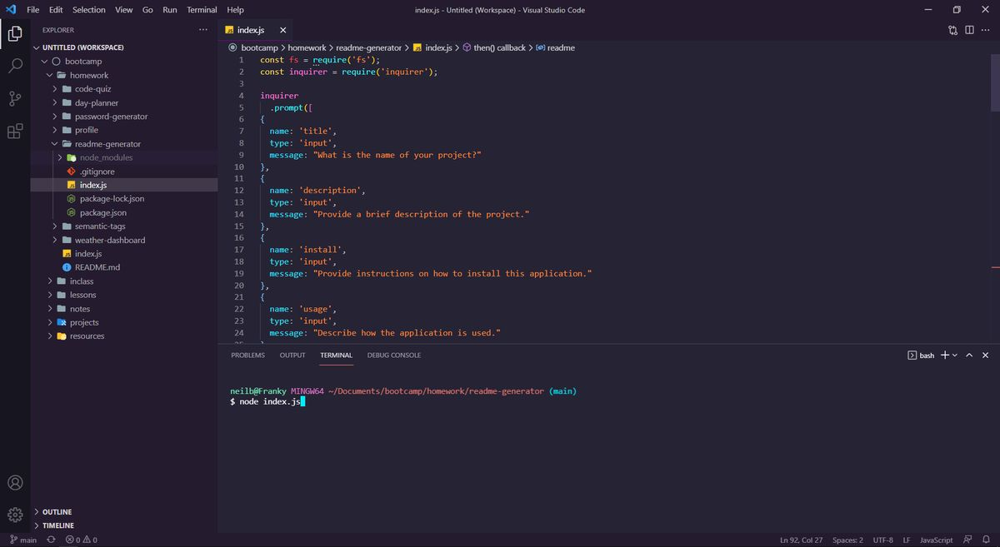
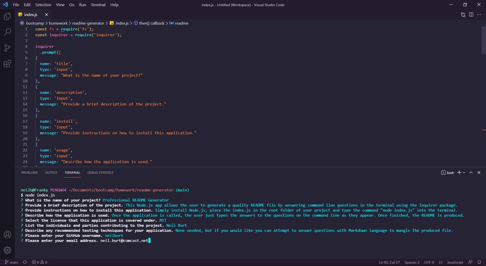
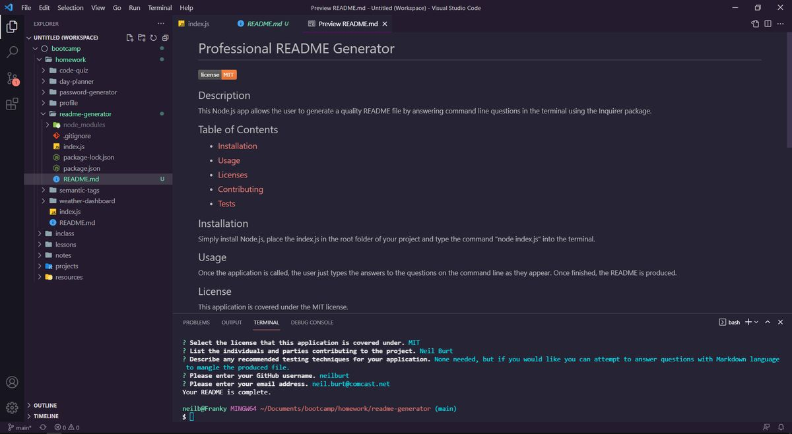

# Professional README Generator  

## Description  

This Node.js app allows the user to generate a quality README file by answering command line questions in the terminal using the Inquirer package.  

## Table of Contents
- ### [Installation](#installation)
- ### [Usage](#usage)
- ### [Screenshots](#screenshots)
- ### [Contributing](#contributing)
- ### [Tests](#tests)
  

## Installation  

Simply install Node.js, place the index.js in the root folder of your project. 

## Usage  

Once the application is called by typing "node index.js" in the terminal, the user just types the answers to the questions on the command line as they appear. Once finished, the README is produced.  

Check out this [demo video](https://drive.google.com/file/d/1ywWZ3ABokFlOLtnPXkb0o5XgUIBq1CWq/view) to see it in action.

## Screenshots
  

---  

  

---  

  

## Contributing  

Neil Burt  

## Tests  

None needed, but if you would like you can attempt to answer questions with Markdown language to mangle the produced file.  

## Questions  

If you have any additional questions:  

Visit my [GitHub profile](https://github.com/neilburt).  

Or you can [email me](mailto:neil.burt@comcast.net).